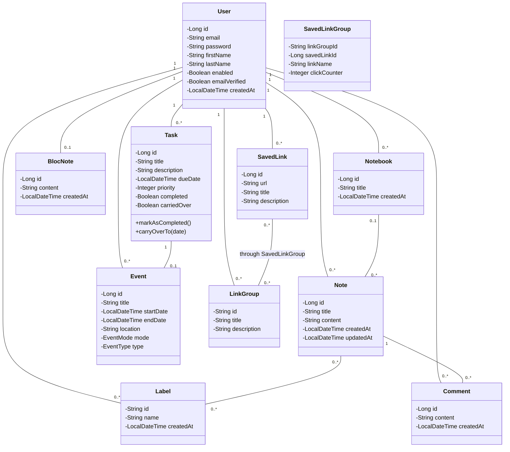

# 📐 Conception - My Web Companion Backend

## 🎯 Vue d'ensemble

My Web Companion est une application d'assistant personnel web permettant de gérer notes, tâches, calendrier, liens favoris et météo.

---

## 📊 Modèle Conceptuel de Données (MCD)

### Entités principales

**USER** (Utilisateur)

- id (PK)
- email (UNIQUE)
- password
- firstName, lastName
- enabled, emailVerified
- timestamps

**NOTE** (Note)

- id (PK)
- title, content
- user_id (FK)
- notebook_id (FK, nullable)
- timestamps

**NOTEBOOK** (Carnet)

- id (PK)
- title
- user_id (FK)
- timestamps

**BLOC_NOTE** (Bloc-note rapide)

- id (PK)
- content
- user_id (FK, UNIQUE)
- timestamps

**LABEL** (Étiquette)

- id (PK, UUID)
- name
- user_id (FK)
- UNIQUE(name, user_id)
- timestamps

**COMMENT** (Commentaire)

- id (PK)
- content
- user_id (FK)
- note_id (FK)
- createdAt

**TASK** (Tâche)

- id (PK)
- title, description
- dueDate
- priority (1, 2, 3)
- completed, completedAt
- carriedOver, orderIndex
- user_id (FK)
- timestamps

**EVENT** (Événement)

- id (PK)
- title, description
- startDate, endDate
- location, meetingLink
- mode (PRESENTIEL, DISTANCIEL)
- type (EVENT, TASK_BASED)
- task_id (FK, nullable, UNIQUE)
- user_id (FK)
- timestamps

**SAVED_LINK** (Lien sauvegardé)

- id (PK)
- url, title, description
- user_id (FK)
- timestamps

**LINK_GROUP** (Groupe de liens)

- id (PK, UUID)
- title, description
- user_id (FK)
- timestamps

**SAVED_LINK_GROUP** (Association Lien-Groupe)

- link_group_id (PK, FK)
- saved_link_id (PK, FK)
- linkName
- clickCounter
- Clé composite: (link_group_id, saved_link_id)

### Relations

- **USER** 1:N **NOTE**
- **USER** 1:N **NOTEBOOK**
- **USER** 1:1 **BLOC_NOTE**
- **USER** 1:N **TASK**
- **USER** 1:N **EVENT**
- **USER** 1:N **SAVED_LINK**
- **USER** 1:N **LINK_GROUP**
- **USER** 1:N **LABEL**
- **USER** 1:N **COMMENT**

- **NOTEBOOK** 1:N **NOTE**
- **NOTE** N:M **LABEL** (table note_labels)
- **NOTE** 1:N **COMMENT**
- **TASK** 1:1 **EVENT** (optionnel)
- **SAVED_LINK** N:M **LINK_GROUP** (via SAVED_LINK_GROUP)

---

## 🗃️ Modèle Logique de Données (MLD)

```
users(#id, email!, password!, firstName, lastName, enabled!, emailVerified!,
      emailVerificationToken, emailVerificationExpiry, createdAt, updatedAt)

notes(#id, title!, content, @user_id!, @notebook_id, createdAt, updatedAt)

notebooks(#id, title!, @user_id!, createdAt, updatedAt)

bloc_notes(#id, content, @user_id!_unique, createdAt, updatedAt)
landrytido@yahoo.com
labels(#id_uuid, name!, @user_id!, createdAt, updatedAt)
  UNIQUE(name, user_id)

note_labels(#@note_id, #@label_id)

comments(#id, content!, @user_id!, @note_id!, createdAt)

tasks(#id, title!, description, dueDate, priority!, completed!, completedAt,
      carriedOver!, orderIndex!, notificationSent!, token_unique,
      @user_id!, createdAt, updatedAt)

events(#id, title!, description, startDate!, endDate!, location,
       meetingLink, mode, type, @task_id_unique, @user_id!,
       createdAt, updatedAt)

saved_links(#id, url!, title!, description, @user_id!, createdAt, updatedAt)

link_groups(#id_uuid, title!, description, @user_id!, createdAt, updatedAt)

saved_link_groups(#@link_group_id, #@saved_link_id, linkName!, clickCounter!)
```

**Légende** :

- `#` = Clé primaire
- `@` = Clé étrangère
- `!` = NOT NULL
- `_unique` = UNIQUE

---

## 🏗️ Diagramme de Classes UML



---

## 👥 Diagramme de Cas d'Utilisation

```mermaid
graph TB
    User((Utilisateur))

    subgraph Auth["🔐 Authentification"]
        UC1[S'inscrire]
        UC2[Se connecter]
        UC3[Se déconnecter]
        UC4[Vérifier email]
        UC5[Gérer profil]
    end

    subgraph Tasks["✅ Gestion Tâches"]
        UC6[Créer tâche]
        UC7[Modifier tâche]
        UC8[Compléter tâche]
        UC9[Filtrer tâches]
        UC10[Fin de journée]
        UC11[Consulter stats]
    end

    subgraph Calendar["📅 Calendrier"]
        UC12[Créer événement]
        UC13[Vue mensuelle]
        UC14[Vue journalière]
        UC15[Lier tâche/événement]
    end

    subgraph Notes["📝 Notes"]
        UC16[Créer note]
        UC17[Organiser en carnets]
        UC18[Ajouter labels]
        UC19[Commenter note]
        UC20[Bloc-note rapide]
        UC21[Rechercher notes]
    end

    subgraph Links["🔗 Liens"]
        UC22[Sauvegarder lien]
        UC23[Créer groupe]
        UC24[Organiser liens]
        UC25[Tracker clics]
        UC26[Top liens]
    end

    subgraph Weather["🌤️ Météo"]
        UC27[Consulter météo]
        UC28[Voir prévisions]
    end

    User --> UC1
    User --> UC2
    User --> UC3
    User --> UC4
    User --> UC5

    User --> UC6
    User --> UC7
    User --> UC8
    User --> UC9
    User --> UC10
    User --> UC11

    User --> UC12
    User --> UC13
    User --> UC14
    User --> UC15

    User --> UC16
    User --> UC17
    User --> UC18
    User --> UC19
    User --> UC20
    User --> UC21

    User --> UC22
    User --> UC23
    User --> UC24
    User --> UC25
    User --> UC26

    User --> UC27
    User --> UC28
```



---

## 🗄️ Diagramme Entité-Relation (ER)

```mermaid
erDiagram
    USER ||--o{ NOTE : "possède"
    USER ||--o{ NOTEBOOK : "possède"
    USER ||--|| BLOC_NOTE : "possède"
    USER ||--o{ LABEL : "crée"
    USER ||--o{ COMMENT : "écrit"
    USER ||--o{ TASK : "a"
    USER ||--o{ EVENT : "planifie"
    USER ||--o{ SAVED_LINK : "sauvegarde"
    USER ||--o{ LINK_GROUP : "organise"

    NOTEBOOK ||--o{ NOTE : "contient"
    NOTE }o--o{ LABEL : "tagué par"
    NOTE ||--o{ COMMENT : "reçoit"

    TASK ||--o| EVENT : "lié à"

    SAVED_LINK }o--o{ LINK_GROUP : "appartient à"

    USER {
        Long id PK
        String email UK
        String password
        String firstName
        String lastName
        Boolean enabled
        Boolean emailVerified
    }

    NOTE {
        Long id PK
        String title
        Text content
        Long user_id FK
        Long notebook_id FK
    }

    NOTEBOOK {
        Long id PK
        String title
        Long user_id FK
    }

    BLOC_NOTE {
        Long id PK
        LongText content
        Long user_id FK,UK
    }

    LABEL {
        String id PK,UUID
        String name
        Long user_id FK
    }

    COMMENT {
        Long id PK
        Text content
        Long user_id FK
        Long note_id FK
    }

    TASK {
        Long id PK
        String title
        Text description
        DateTime dueDate
        Integer priority
        Boolean completed
        Boolean carriedOver
        Long user_id FK
    }

    EVENT {
        Long id PK
        String title
        DateTime startDate
        DateTime endDate
        String mode
        String type
        Long task_id FK,UK
        Long user_id FK
    }

    SAVED_LINK {
        Long id PK
        String url
        String title
        Long user_id FK
    }

    LINK_GROUP {
        String id PK,UUID
        String title
        Long user_id FK
    }
```

---

## 🔄 Workflows principaux

### 1. Workflow "Fin de journée"

```
1. Utilisateur clique sur "Fin de journée"
2. Système identifie les tâches non complétées du jour
3. Utilisateur choisit date de report (demain/autre)
4. Système :
   - Marque carriedOver = true
   - Change dueDate
   - Conserve orderIndex ou réorganise
5. Retour liste tâches reportées
```

### 2. Workflow "Créer événement depuis tâche"

```
1. Utilisateur crée/édite tâche avec dueDate
2. Option : lier au calendrier
3. Système crée Event avec :
   - type = TASK_BASED
   - relatedTask = task.id
   - startDate = task.dueDate
   - endDate = calculé (durée par défaut)
4. Synchronisation bidirectionnelle
```

### 3. Workflow "Organisation de liens"

```
1. Utilisateur sauvegarde lien
2. Ajoute lien à un/plusieurs groupes
3. Personnalise le nom par groupe
4. Chaque clic incrémente clickCounter
5. Dashboard affiche top liens par groupe
```

---

## 🎨 Contraintes et règles métier

### Règles d'intégrité

1. **User unique** : email UNIQUE
2. **BlocNote unique** : 1 par utilisateur (relation 1:1)
3. **Label unique** : (name, user_id) UNIQUE
4. **Event-Task** : relation 1:1 optionnelle
5. **Token Task** : UNIQUE pour notifications

### Règles de cascade

- **User supprimé** → Suppression en cascade de toutes ses données
- **Notebook supprimé** :
  - Sans forceDelete → Erreur si notes présentes
  - Avec forceDelete → Notes déplacées hors carnet
- **Label supprimé** :
  - Sans forceDelete → Erreur si notes associées
  - Avec forceDelete → Suppression + dissociation notes
- **Task supprimée** → Event associé supprimé si TASK_BASED

### Règles de validation

- **Task.priority** : 1 (basse), 2 (moyenne), 3 (haute)
- **Event.mode** : PRESENTIEL | DISTANCIEL
- **Event.type** : EVENT | TASK_BASED
- **Forecast.days** : 1-10 jours max

---

## 📈 Optimisations

### Index recommandés

```sql
-- Recherches fréquentes
CREATE INDEX idx_notes_user_id ON notes(user_id);
CREATE INDEX idx_tasks_user_due ON tasks(user_id, due_date);
CREATE INDEX idx_events_user_date ON events(user_id, start_date);
CREATE INDEX idx_labels_user_name ON labels(user_id, name);

-- Recherches full-text
CREATE FULLTEXT INDEX idx_notes_search ON notes(title, content);
CREATE FULLTEXT INDEX idx_links_search ON saved_links(title, description);
```

### Lazy Loading

- Toutes les relations OneToMany en LAZY
- BatchSize = 10 pour éviter N+1

### JSON ignore

- Relations bidirectionnelles annotées @JsonIgnore
- Password jamais exposé

---

## 🛡️ Sécurité

### Authentification

- JWT avec access token (24h) + refresh token (7j)
- BCrypt pour hash des passwords
- Email verification avant activation compte

### Autorisation

- Toutes les routes (sauf /auth, /health, /weather) authentifiées
- Vérification ownership : user_id = authenticated user

### CORS

- Configuré pour accepter tous origins (développement)
- À restreindre en production

---

**Version** : 1.0  
**Date** : Janvier 2026  
**Auteur** : Projet de stage
